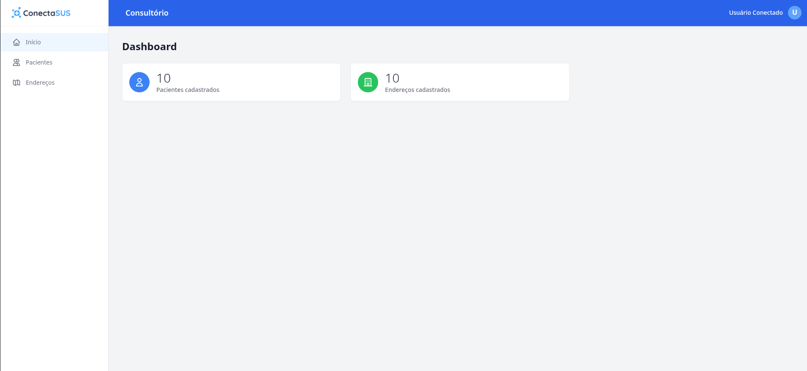
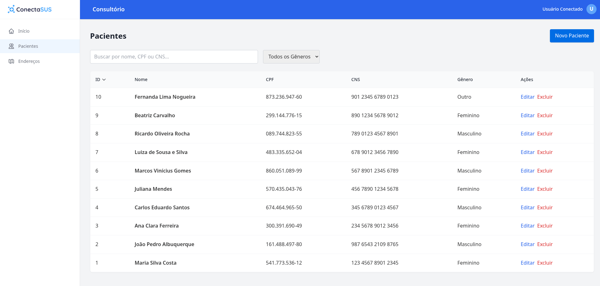
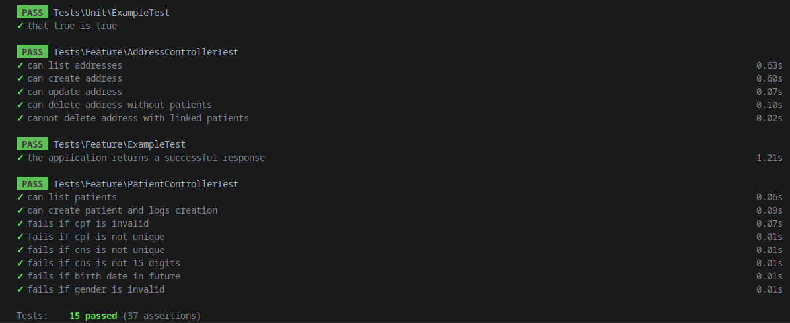
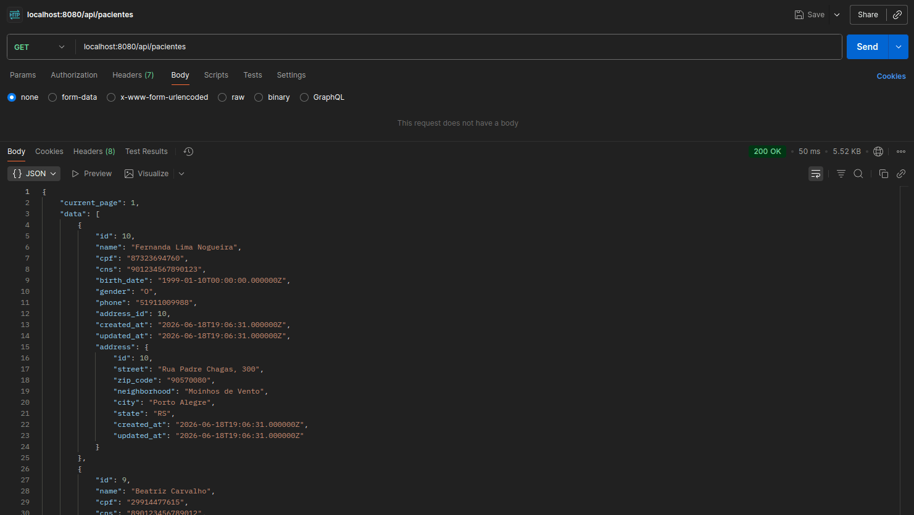
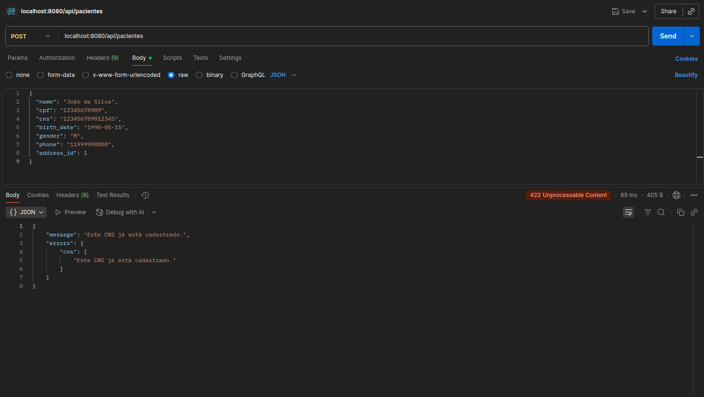
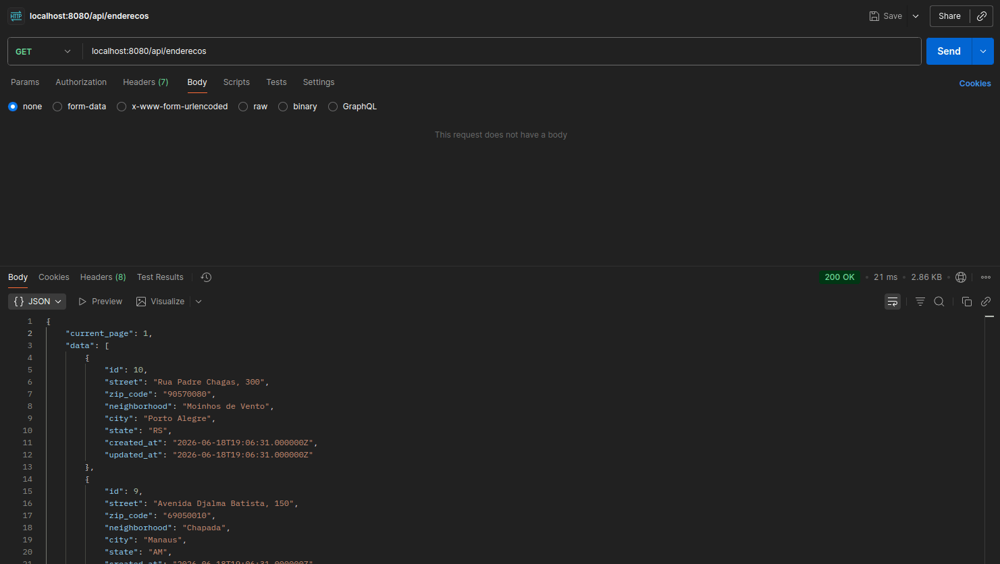
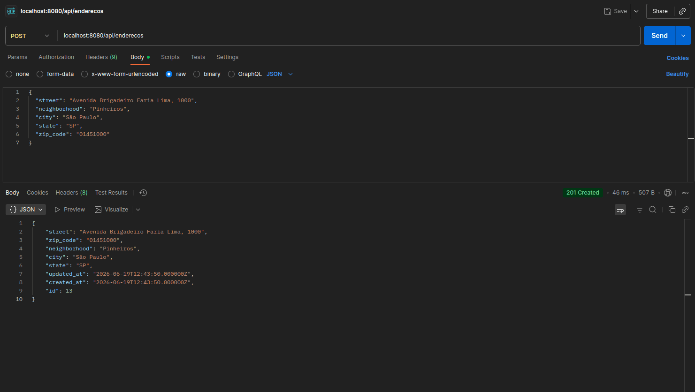

# Sistema de Cadastro de Pacientes — Módulo de Saúde

Bem-vindo ao Sistema de Cadastro de Pacientes! Esta aplicação web atende a todos os requisitos do Desafio para Desenvolvedor Full Stack, construída com **Laravel 13** no backend e **Vue.js 2** na Single Page Application (SPA).

## 🚀 Tecnologias

- **Backend:** PHP 8, Laravel 13, MySQL
- **Frontend:** JavaScript, Vue.js 2, Vuex, Vue Router, Tailwind CSS, VeeValidate, Vite
- **Infraestrutura:** Docker, Docker Compose, Nginx

## 📸 Telas do Projeto

### DASHBOARD


### PACIENTES E ENDEREÇOS



### TESTES AUTOMATIZADOS


### TESTES POSTMAN
#### PACIENTES



### ENDEREÇOS



## 🛠️ Arquitetura e Diferenciais

O projeto foi construído pensando na aderência a boas práticas e escalabilidade:
- **Repository Pattern:** O acesso aos dados e abstrações do Eloquent (buscas, paginação) estão encapsulados em repositórios (`AddressRepository`, `PatientRepository`).
- **Service Layer:** As regras de negócio (RN-01 a RN-09) foram centralizadas nas classes de serviço.
- **Componentização Avançada:** O frontend utiliza componentes altamente reutilizáveis como `BaseInput` e `BaseTable` para escalar e manter consistência visual (Tailwind CSS).
- **Global Error Handling & Logs:** Exceções globais em JSON pelo backend e um canal de Log (`daily`) registrando todas as mutações no banco.
- **Validação Algorítmica Governamental:** O backend implementa rigorosamente os algoritmos matemáticos oficiais (Módulo 11 do Datasus para CNS e algoritmo da Receita Federal para CPF) via *Custom Rules* nativas (`CnsRule`, `CpfRule`), blindando o banco contra números fictícios.
- **Validações Reactivas:** O frontend conta com máscaras e checagens client-side utilizando `vee-validate`.
- **Testes Automatizados:** Suíte de Feature Tests no PHPUnit cobrindo os endpoints da API.

---

## ⚙️ Instruções de Instalação e Execução

Você pode executar o projeto de forma extremamente simples com Docker e Docker Compose. Todo o ambiente (PHP-FPM, Nginx, MySQL e o Build do Frontend) já está devidamente orquestrado.

### 1. Clonar o repositório
```bash
git clone https://github.com/SEU-USUARIO/sistema-cadastro-de-pacientes.git
cd sistema-cadastro-de-pacientes
```

### 2. Configurar as variáveis de ambiente
Crie o arquivo `.env` na raiz do projeto com base no arquivo de exemplo e defina suas senhas, caso deseje alterar do padrão:
```bash
cp .env.example .env
```
*(Certifique-se de que o `LOG_CHANNEL=daily` está configurado).*

### 3. Subir os Containers Docker
Execute o comando abaixo para realizar o build das imagens (Backend e Node) e subir os containers em background.
```bash
docker-compose up -d --build
```
> **Nota de Arquitetura:** O container `frontend` é efêmero por design. Ele liga, roda o `npm run build` gerando a pasta `/dist` pronta para a Web, e se desliga automaticamente. O container `nginx` é quem assume e serve as páginas estáticas na porta `8080`.

### 4. Instalar as dependências do Laravel
```bash
docker-compose exec app composer install
```

### 5. Configurar o Banco de Dados e Seeders
Crie a estrutura de tabelas e insira os dados realistas iniciais:
```bash
docker-compose exec app php artisan migrate --seed
```

---

## 💻 Modos de Uso (Dev vs Prod)

A aplicação suporta dois cenários perfeitamente isolados para visualização:

### Ambiente de Produção (Avaliação Final)
Para testar o aplicativo completo como se estivesse no ar:
- Mantenha os containers do Docker rodando em background.
- Acesse em seu navegador: **[http://localhost:8080](http://localhost:8080)**
- A interface é servida diretamente pelo Nginx a partir dos arquivos "buildados".

### Ambiente de Desenvolvimento (Vite HMR)
Para codificar o Frontend com *Hot Module Replacement* (atualizações instantâneas sem compilar):
1. Mantenha os containers Docker rodando para prover o Backend e Banco de Dados.
2. Em um terminal à parte, entre na pasta do frontend e instale os pacotes Node localmente:
```bash
cd frontend
npm install
npm run dev
```
3. Acesse em seu navegador: **[http://localhost:3000](http://localhost:3000)**
> O Vite na porta 3000 possui um **Proxy Reverso** embutido que detecta requisições feitas a `/api` e as envia invisivelmente para o Nginx (`8080`), permitindo que você desenvolva a interface sem erros de CORS.

---

## 🧪 Rodando os Testes Automatizados (PHPUnit)

A aplicação conta com testes de funcionalidade cobrindo os CRUDs. Para executá-los via Docker, rode:
```bash
docker-compose exec app php artisan test
```

---

## 📮 Manual de Testes da API (Postman / Insomnia)

Para validar a integridade da API diretamente (sem passar pelo Frontend Vue.js), utilize os endpoints abaixo apontando para `http://localhost:8080/api`.

> **Headers Obrigatórios em todas as requisições:**
> `Accept`: `application/json`
> `Content-Type`: `application/json`

### 📊 Dashboard
- **`GET` /dashboard**
Retorna a contagem de pacientes e endereços no formato `{"patients_count": 10, "addresses_count": 5}`.

### 📍 Endereços (Addresses)
- **`GET` /enderecos** (Listagem com paginação)
  - *Filtros Suportados:* `?search=paulista`, `?state=SP`, `?sort_by=city&sort_dir=desc`, `?per_page=15`
- **`POST` /enderecos** (Criação)
  - **Exemplo de Payload (JSON):**
    ```json
    {
      "street": "Avenida Paulista, 1578",
      "zip_code": "01310100",
      "neighborhood": "Bela Vista",
      "city": "São Paulo",
      "state": "SP"
    }
    ```
- **`GET` /enderecos/{id}** (Busca individual)
- **`PUT` /enderecos/{id}** (Atualização Total)
- **`DELETE` /enderecos/{id}** (Exclusão)
  - *Regra de Negócio:* Retornará `400 Bad Request` se houver pacientes vinculados.

### 🏥 Pacientes (Patients)
- **`GET` /pacientes** (Listagem com paginação)
  - *Filtros Suportados:* `?search=15717349025` (Nome, CPF ou CNS), `?gender=M`, `?sort_by=name&sort_dir=asc`
- **`POST` /pacientes** (Criação)
  - *Regras de Negócio:* Validação matemática rigorosa de CPF, CNS, formatação de data e unicidade de documentos.
  - **Exemplo de Payload Válido (JSON):**
    ```json
    {
      "name": "Maria da Silva",
      "cpf": "60950633100",
      "cns": "873691540517552",
      "birth_date": "1985-03-15",
      "gender": "F",
      "phone": "11987654321",
      "address_id": 1
    }
    ```
    *(Nota: Se receber erro 422 de "já cadastrado", altere 1 dígito válido do CPF/CNS no Postman, pois a API respeita o `unique` rigorosamente).*
- **`GET` /pacientes/{id}** (Busca individual)
- **`PUT` /pacientes/{id}** (Atualização)
- **`DELETE` /pacientes/{id}** (Exclusão)
